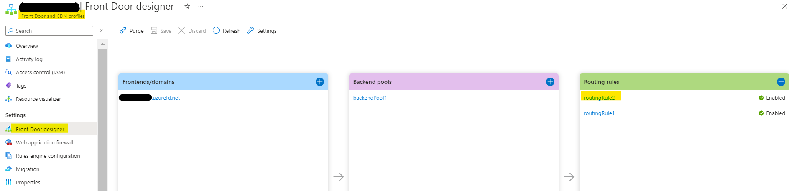
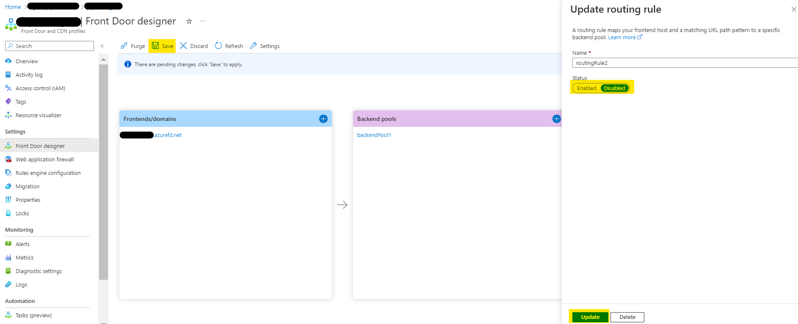

## Improved security for Company Communicator app template authoring experience

A recent security change in the Microsoft Teams client may cause an error to appear in the Company Communicator app template authoring experience in the Microsoft Teams. The users in your organization might see an error while accessing the message authoring experience in the Company Communicator app in Teams, with the error message **“Sorry, an error occurred while trying to access the service”**. Users will observe this issue on the Classic Teams web client, and also on the new Teams desktop and web clients. This can be observed in various environments like Commercial, GCC, GCC-High, and DoD and the below fix will be applicable to all the environments respectively.

The issue can be addressed with a configuration change. The following steps will guide you through the process of updating the configuration to address it and ensure that the Company Communicator app template authoring experience is secure - 

- Open the Azure portal, locate and select Company Communicator app Resource group by using the search bar, or navigate to Resource groups from the Azure portal menu.
- Select the Azure Front Door resource from the list of resources in the Company Communicator app Resource group.
- Under Settings section in the left-hand side menu, locate the Front Door designer.

- Select **"routingRule2"** that was created during the Company Communicator app deployment. 
- Update the status of the routing rule to **Disabled** and click on **Update**.

- Click on **Save** to save the changes.
- Browse to the App Service resource under the CC resource group and restart the app service.
- Users may also need to clear the cache on the Teams desktop client ([Classic Teams or new Teams](https://learn.microsoft.com/en-us/microsoftteams/troubleshoot/teams-administration/clear-teams-cache)).

