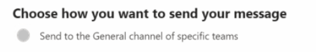

## Where do i deploy the user bot to?

It's recommended to deploy the users bot to everyone through the Global Setup Policy in the Teams Admin center.

>You don't necessarily have to pin the application to the rail at this point.

## How to Add The Users App/Bot to Specific Teams



What if you only want a specific list of teams to appear in the Search ,further more you're required to first deploy the UserBot to this team.

How do we do this , if we have a large amount of teams say 10000.

## Export a List of Teams Via PowerShell to CSV
>For tenants with a large amount of teams its advised that you add additional filters to the Get-Team command.
```
Connect-MicrosoftTeams -Interactive
Get-Team| Export-Csv -Path c:\temp\MylistofTeams.csv -NoTypeInformation
```

## Add an App Via PowerShell & CSV.

Format your CSV like this:
|TeamName|TeamId|AppId|
|----|----|----|
|My test team|{guid}|{guid}
| my first project|b9cc7986-dd56-4b57-ab7d-9c4e5288b775|b9cc7986-dd56-4b57-ab7d-9c4e5288b775|

>For tenants with a large amount of teams its advised that you add perform the below in waves.

```
Connect-MicrosoftTeams -Interactive
import-csv c:\Temp\MylistofTeams.csv| ForEach-Object {
Add-TeamsAppInstallation -AppId $_.AppId -TeamId $_.TeamId
}
```

>This command is currently in public preview. For more information please see [add-teamsappinstallation](https://docs.microsoft.com/en-us/powershell/module/teams/add-teamsappinstallation?view=teams-ps#examples)