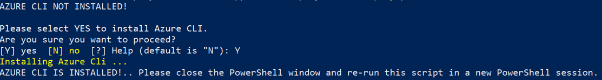
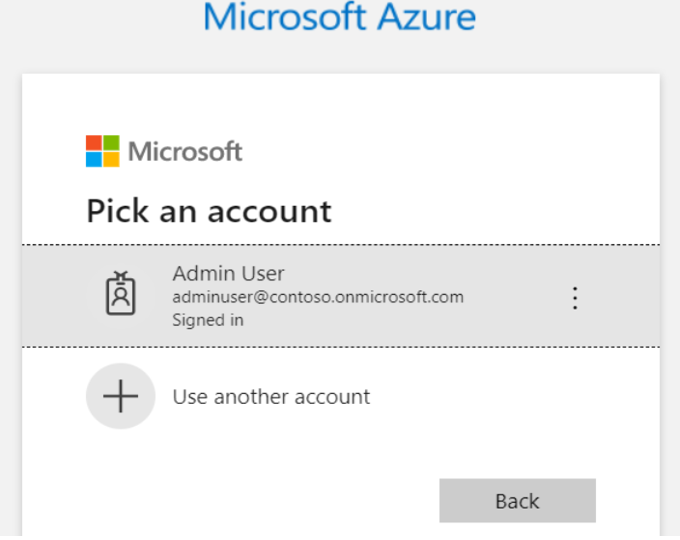
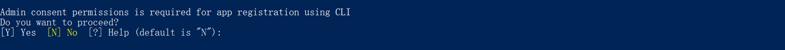
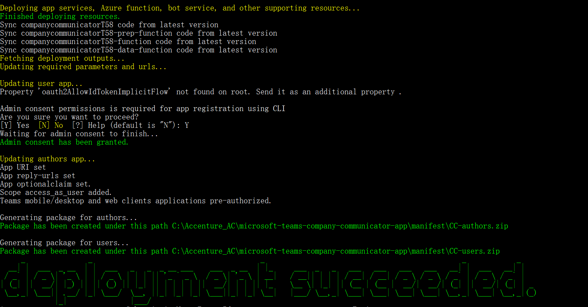
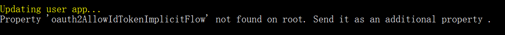
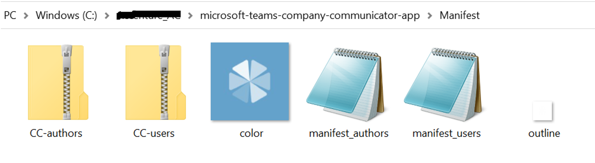
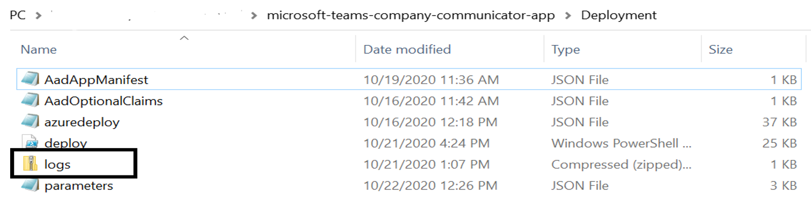
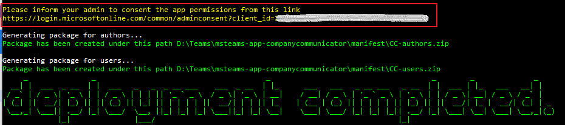

- Deployment Guide **RECOMMENDED**
    - [Prerequisites](#prerequisites)
    - [Steps](#Deployment-Steps)
        - [Deploy to your Azure subscription](#1-deploy-to-your-azure-subscription)
        - [Update parameters.json file](#2-Update-parameters-file)
        - [Execute script](#3-Execute-script)
        - [Install the apps in Microsoft Teams](#4-install-the-apps-in-microsoft-teams)
    - [Troubleshooting](#troubleshooting)
- - -

# Prerequisites
To begin, you will need:  

* An Azure subscription where you can create the following kinds of resources:
    * App Service
    * App Service Plan
    * Bot Channels Registration
    * Azure Function
    * Azure Storage Account
    * Service Bus
    * Application Insights
    * Azure Key vault
* An role to assign roles in Azure RBAC. To check if you have permission to do this, 
    * Goto the subscription page in Azure portal. Then, goto Access Control(IAM) and click on `View my access` button.
    * Click on your `role` and in search permissions text box, search for `Microsoft.Authorization/roleAssignments/Write`.
    * If your current role does not have the permission, then you can grant yourself the built in role `User Access Administrator` or create a custom role.
    * Please follow this [link](https://docs.microsoft.com/en-us/azure/role-based-access-control/custom-roles#steps-to-create-a-custom-role) to create a custom role. Use this action `Microsoft.Authorization/roleAssignments/Write` in the custom role to assign roles in Azure RBAC.
* A team with the users who will be sending messages with this app. (You can add and remove team members later!)
* A copy of the Company Communicator app GitHub repo ([https://github.com/OfficeDev/microsoft-teams-company-communicator-app](https://github.com/OfficeDev/microsoft-teams-company-communicator-app))

> NOTE:  If you plan to use a custom domain name instead of relying on Azure Front Door, read the instructions [here](https://github.com/OfficeDev/microsoft-teams-company-communicator-app/wiki/Custom-domain-option) first.

---

# Deployment Steps

## 1. Deploy to your Azure subscription

  Please follow below steps to deploy app template:

- Download the whole solution folder from [GitHub](https://github.com/OfficeDev/microsoft-teams-company-communicator-app)
- Unzip the Content to a folder. (say companyCommunicator)
- Open a PowerShell window in **administrator** mode and navigate to the folder where you unzipped the content.
- Navigate to Deployment folder.
    ```  
    cd microsoft-teams-apps-company-communicator-main\Deployment
    ```

- Run the below command to check if jq is installed or not.
    ```
    jq --version
    ```

    If jq is not installed, you can install [jq](https://stedolan.github.io/jq/download/) using [chocolatey](https://chocolatey.org/install).
    > jq is required to generate the User and Author application package.

    Run the below command to install chocolatey

    ```
    Set-ExecutionPolicy Bypass -Scope Process -Force; [System.Net.ServicePointManager]::SecurityProtocol = [System.Net.ServicePointManager]::SecurityProtocol -bor 3072; iex ((New-Object System.Net.WebClient).DownloadString('https://chocolatey.org/install.ps1'))
    ```

    Run the below command to install Jq

    ```
    chocolatey install jq
    ```
- Run the below command. This will allow you to run deploy.ps1. By default, the execution policy is restricted. You may change it to back restricted after deployment is completed.
    ```
    Set-ExecutionPolicy -ExecutionPolicy RemoteSigned
    ```
- Run the below command to unblock the deployment script.
    ```
    Unblock-File -Path .\deploy.ps1
    ```

---
# 2. Update parameters file
- You will find a `paramters.json` file under Deployment folder. Please update all the parameters.

  

- Replace `<<value>>` with appropriate value for all the required fields. Make sure you review the default values for optional fields.
- You may refer to the following:

    - `subscriptionId` - Azure subscription to deploy the solution to (MUST be associated with the Azure AD of the Office 365 tenant that you wish to deploy this solution to.) e.g. 22f602c4-1b8f-46df-8b73-45d7bdfbf58e.
    - `subscriptionTenantId` - Id of the tenant to deploy to (If you are not sure how to get Tenant ID, please check Azure Active Directory in Azure Portal. Under Manage, click Properties. The tenant ID is shown in the Directory ID box). e.g 98f3ece2-3a5a-428b-aa4f-4c41b3f6eef0. Tenant ID is also available in the `Overview` section".
    - `userObjectId` - Object Id of the user to deploy to (If you are not sure how to get Object ID, please check Azure Active Directory in Azure Portal. Under Manage, click Users and select the appropriate user. The Object ID is shown in the Identity section). e.g 98f3ece2-3a5a-428b-aa4f-4c41b3f6eef0.
    - `resourceGroupName` - Name for a new resource group to deploy the solution to - the script will create this resource group. e.g. CompanyCommunicatorRG.
    - `region` - Azure region in which to create the resources. The internal name should be used e.g. eastus. Run the following command in Powershell to list internal names.
      ```
      az account list-locations -o table
      ```
    - `baseResourceName` - which the template uses to generate names for the other resources.
      - The [Base Resource Name] must be available. For example, if you select contosocommunicator as the base name, the name contosocommunicator must be available (not taken); otherwise, it will prompt you to confirmation dialog to update the existing resources.
      - [Base Resource Name] -data-function, [Base Resource Name] -function etc.

    - `tenantId` - Tenant Id where the teams application will be installed. If the Azure subscription is in the same tenant, copy `subscriptionTenantId` parameter value.
    > **Note**: If your Azure subscription is in a different tenant than the tenant where you want to install the Teams App, please update the Tenant Id field with the tenant where you want to install the Teams App.
    - `senderUPNList` - this is a semicolon-delimited list of users (Authors) who will be allowed to send messages using the Company Communicator.
       For example, to allow Megan Bowen ([meganb@contoso.com](mailto:meganb@contoso.com)) and Adele Vance ([adelev@contoso.com](mailto:adelev@contoso.com)) to send messages, set this parameter to `meganb@contoso.com;adelev@contoso.com`.
       You can change this list later by going to the `App Service > Configuration` blade.

    - `isUpgrade` - If this is an upgrade for old version of the app template, then value should be true. Otherwise, false is default (First-time deployment).

    - `useCertificate` - If certificate authentication is being used, then value should be true. Otherwise, false is default (Client-secret will be used).

    - `authorAppCertName` - If certificate authentication is being used, then give the name for the new certificate of author bot Azure AD app to be created in Azure Key vault.

    - `userAppCertName` - If certificate authentication is being used, then give the name for the new certificate of user bot Azure AD app to be created in Azure Key vault.

    - `graphAppCertName` - If certificate authentication is being used, then give the name for the new certificate of graph app Azure AD app to be created in Azure Key vault.
    
    - `customDomainOption` - How the app will be hosted on a domain that is not \*.azurewebsites.net. Azure Front Door is an easy option that the template can set up automatically, but it comes with ongoing monthly costs.
    > **NOTE**:  If you plan to use a custom domain name instead of relying on Azure Front Door, read the instructions [here](https://github.com/OfficeDev/microsoft-teams-company-communicator-app/wiki/Custom-domain-option) first.
    
    - `proactivelyInstallUserApp`: If proactive app installation should be enabled. Default is true. If enabled, the application will proactively install the User bot for recipients.
    - `userAppExternalId`: Default value is 148a66bb-e83d-425a-927d-09f4299a9274. This is the external Id provided in the User app manifest.
    - `serviceBusWebAppRoleNameGuid`: Default value is `958380b3-630d-4823-b933-f59d92cdcada`. This **MUST** be the same `id` per app deployment.
   
        > **Note:** Make sure to keep the same values for an upgrade. Please change the role name GUIDs in case of another Company Communicator Deployment in same subscription.

    - `serviceBusPrepFuncRoleNameGuid`: Default value is `ce6ca916-08e9-4639-bfbe-9d098baf42ca`. This **MUST** be the same `id` per app deployment.
    - `serviceBusSendFuncRoleNameGuid`: Default value is `960365a2-c7bf-4ff3-8887-efa86fe4a163`. This **MUST** be the same `id` per app deployment.
    - `serviceBusDataFuncRoleNameGuid`: Default value is `d42703bc-421d-4d98-bc4d-cd2bb16e5b0a`. This **MUST** be the same `id` per app deployment.
    - `storageAccountWebAppRoleNameGuid`: Default value is `edd0cc48-2cf7-490e-99e8-131311e42030`. This **MUST** be the same `id` per app deployment.
    - `storageAccountPrepFuncRoleNameGuid`: Default value is `9332a9e9-93f4-48d9-8121-d279f30a732e`. This **MUST** be the same `id` per app deployment.
    - `storageAccountDataFuncRoleNameGuid`: Default value is `5b67af51-4a98-47e1-9d22-745069f51a13`. This **MUST** be the same `id` per app deployment.
    - `defaultCulture`:  By default the application uses `en-US` locale. You can choose another locale from the list [here](https://github.com/OfficeDev/microsoft-teams-company-communicator-app/wiki/Localization), if you wish to use the app in different locale.
    - `hostingPlanSku`: The pricing tier for the hosting plan. Default value: Standard. You may choose between Basic, Standard and Premium.
    - `hostingPlanSize`: The size of the hosting plan (small - 1, medium - 2, or large - 3). Default value: 2.
    
        > **Note:** The default value is 2 to minimize the chances of an error during app deployment. After deployment you can choose to change the size of the hosting plan.

    - `gitRepoUrl` - The URL to the GitHub repository to deploy. Default value: [https://github.com/OfficeDev/microsoft-teams-company-communicator-app.git](https://github.com/OfficeDev/microsoft-teams-company-communicator-app.git)
    - `gitBranch` - The branch of the GitHub repository to deploy. Default value: main
    - `appDisplayName` - The app (and bot) display name. Default value:Company Communicator.
    - `appDescription` - The app (and bot) description. Default value: Broadcast messages to multiple teams and people in one go.
    - `appIconUrl` - The link to the icon for the app. It must resolve to a PNG file. Default value [https://raw.githubusercontent.com/OfficeDev/microsoft-teams-company-communicator-app/main/Manifest/color.png](https://raw.githubusercontent.com/OfficeDev/microsoft-teams-company-communicator-app/main/Manifest/color.png)

    - `companyName` - The display name for the company.
    - `websiteUrl` - The https:// URL to you company's website. This link should take users to your company or product-specific landing page.
    - `privacyUrl` - The https:// URL to the company's privacy policy.
    - `termsOfUseUrl` - The https:// URL to the company's terms of use.

---

# 3. Execute script

- Open a PowerShell window in **administrator** mode and navigate to Deployment folder
    ```  
    cd microsoft-teams-apps-company-communicator-main\Deployment
    ```
- Execute the `deploy.ps1` script in the Powershell window:
    ```
    .\deploy.ps1
    ```

- If the Azure CLI is not installed, it will prompt you to confirmation dialog to install azure CLI. Enter `Y` to proceed.

  

>**Note** : Restart the Powershell after Azure CLI is installed. The script will automatically **exit** just after CLI application installation. It will ask you to open a new session and re-run the script.

- If the azure CLI application is already installed, the script will check if the following modules are installed.
  

> Note: The script requires Azure CLI `v.2.2` or later. The script will install Azure CLI if its not already installed. If it is already installed, make sure its `v2.2` or later.

- The script will prompt *twice* for authentication during execution, once to get access to the Azure subscription, and the other to get access to Azure Active Directory. Please login using an account that has **contributor** role or higher.

  

  

- The script will next validate if the Azure resources exists in the selected region and if the resources names are available. If resources with same name already exist, the script will show a confirmation box asking it should update the existing resources. Enter `Y` to proceed.

  

- If Azure AD application (user or author) exist in the tenant, the script will show confirmation dialog to update current applications and configurations. Choose `Y` to update them.

  

- If the ARM template deployment completes successfully, script will prompt you to update the AD app settings &quot;Admin consent permissions is required for app registration using CLI&quot;. After choosing yes, the script will provide admin consent to AD app.

  

> **Note**: Deployment may take an hour or more. Make sure you are connected to the internet. Do not close the Powershell window.

- When the script is completed a `DEPLOYMENT SUCCEEDED` message will be displayed and the script will open the folder that contains the app packages (zip files).

  

> **Note** - While updating the user app, script may throw a warning message as below. Please ignore this warning, the backend data has been updated.

  

- The script will finally generate zip files for the User and author application.

  

- After running the script. AD apps, Bot/Config Apps, and all required resources will be created.
- If PowerShell script breaks during deployment, you may run the deployment again if there is no conflict (a resource name already exist in other resource group or another tenant) or refer to Troubleshooting page.
- If PowerShell script keeps failing, you may share deployment logs (generated in Deployment\logs.zip) with the app template support team.

  

> Note: If the `tenantId` and `subscriptionTenantId` are different, you may need to grant admin consent for `tenantId` tenant. The script will post a message with the url. Refer to image below.

  
    
---

## 4. Install the apps in Microsoft Teams


1. Install the authors app (the `cc-authors.zip` package) to your team of message authors.
    * Note that even if non-authors install the app, the UPN list in the app configuration will prevent them from accessing the message authoring experience. Only the users in the sender UPN list will be able to compose and send messages. 
    * If your tenant has sideloading apps enabled, you can install your app by following the instructions [here](https://docs.microsoft.com/en-us/microsoftteams/platform/concepts/apps/apps-upload#load-your-package-into-teams).

> **IMPORTANT:** We recommend installing the authors app to the appropriate team as a custom (sideloaded) app. Do NOT use [app permission policies](https://docs.microsoft.com/en-us/microsoftteams/teams-app-permission-policies) to restrict access to this app to the members of the authors team. Otherwise, members of the authoring team may not receive messages sent from Company Communicator.

2. Add the configurable tab to the team of authors, so that they can compose and send messages.

3. [Upload](https://docs.microsoft.com/en-us/microsoftteams/tenant-apps-catalog-teams) the User app to your tenant's app catalog so that it is available for everyone in your tenant to install.
> **IMPORTANT:** Proactive app installation will work only if you upload the User app to your tenant's app catalog.

4. Install the User app (the `cc-users.zip` package) to the users and teams that will be the target audience. 
> If `proactiveAppInstallation` is enabled, you may skip this step. The service will install the app for all the recipients when authors send a message.

> **NOTE:** If you are deploying a version of Company Communicator prior to version 4, do NOT use app permission policies to restrict the authors app to the members of the authors team. Microsoft Teams does not support applying different policies to the same bot via two different app packages. 

---

# Troubleshooting

  Please check the [Troubleshooting](Troubleshooting-powershell-script) guide.