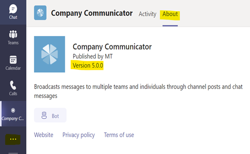
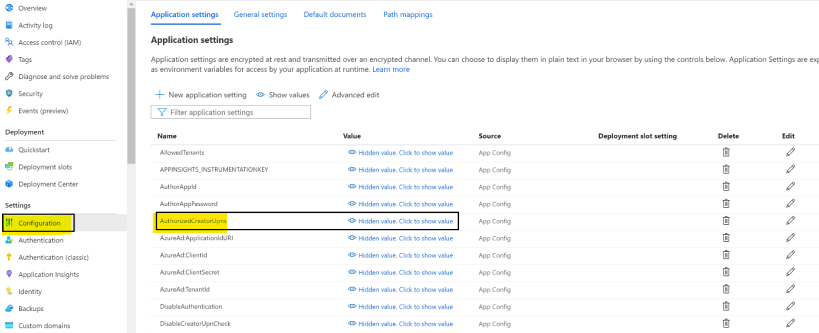
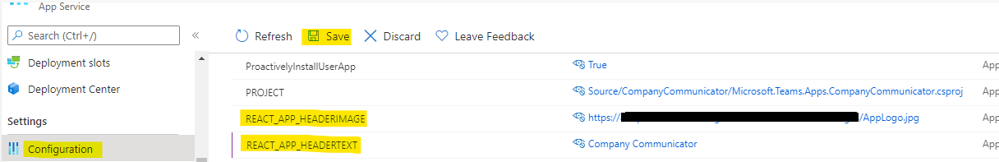
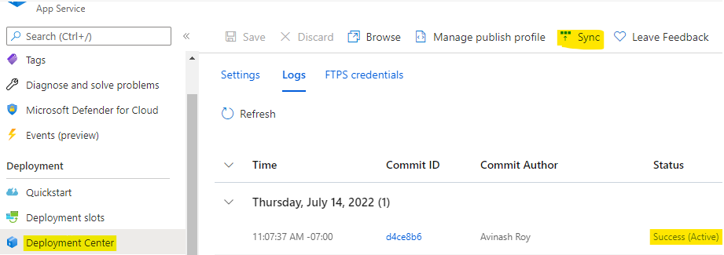
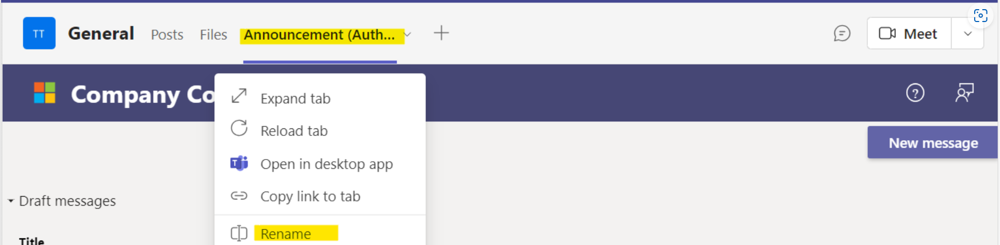

## Known Limitations
### 1. Author/publishing experience is not supported on Mobile

The tab where authors/creators of messages create a message is not supported on mobile. The recommended approach is to create the messages on the desktop only.

## FAQs

### 1. Are messages sent to guest users?
As of version 4.1.1, guest users are excluded from receiving messages. Note that they will still be able to view messages posted to a channel.

> **IMPORTANT:** If you are using a version of Company Communicator **v4.1.1**, please update to the latest version, and see the guidance in [Excluding guest users from messages](https://github.com/OfficeDev/microsoft-teams-apps-company-communicator/wiki/Excluding-guest-users-from-messages).

### 2. Does Company Communicator respond with a message to users who ask a question or reply to a message?
No, by default the bot only sends messages and does not respond with a message. The bot can be customized to reply with a custom message or connected to a knowledge base to respond with answers from the knowledge base.

### 3. Is it mandatory to choose multi-tenant account types while app registration?
Yes. Bot Channels Registration only supports multi-tenant account types. Please choose multi-tenant type options only even if the app users belong to single-tenant only. Please refer [here](https://docs.microsoft.com/en-us/azure/bot-service/bot-service-quickstart-registration?view=azure-bot-service-4.0#manual-app-registration) for more information

| Type | Description |
|--|--|
| Accounts in any organizational directory (Any Azure AD - Multitenant) | This option provides less exposure by restricting access and in case OAuth is not supported. |
| Accounts in any organizational directory (Any Azure AD - Multitenant) and personal Microsoft accounts (for example, Xbox, Outlook.com) | This option is well-suited to support OAuth and bot authentication. |

### 4. How to clone the GitHub repository?
Please follow this [link](https://docs.github.com/en/github/creating-cloning-and-archiving-repositories/cloning-a-repository) for detailed instructions on cloning GitHub repository to create a local copy on your computer and sync between the two locations.

### 5. I'm using v4.1 Company Communicator. When I resync the Company Communicator, can I set up the v4.1 branch instead of main or v4.1.x?
If you're planning to deploy version ~4, you can select the branch as v4.x but it will not point to the specific 4.1 version. Instead, it will have the highest 4.x version i.e., v4.1.5. 

### 6. Can I change the app service plan without any issues? 
Yes, the app service plan can be changed to S1 without going for re-deployment. The recommended instance is S2 for better performance, however the app will work for S1 as well, provided the messages sent to limited users. 

### 7. When I export the results of a sent message the author bot on the desktop client shows "Go back to the main window to see this content". 
 
 
 The issue seems specific to your Teams setup and not related to the Company Communicator app. 

### 8. I'm sending messages every week to more than 100k users, does CC supports this volume? Which strategy is suggested in this case? 
Yes, refer below on the versions and the volumes that CC supports sending,

- 5.x supports 2 million messages (approximately). 
- 4.1.5 supports 100k messages (approximately). 

### 9. Is it possible to use Linux over Windows in App service plan? 
The default app service plan for CC deployment is Windows, if you want to use Linux, then you need to customize the ARM template to deploy it using Linux and go for fresh installation with the customized version. 

### 10. How do I know the version of the app? 

### 11. Can I update the list of authors after deploying the app?
Yes, you can update the list of authors after deploying the Company Communicator app by going to the deployed Azure App Service.
1. Go to deployed Azure Resource Group -> Azure App Service.
2. Select the configuration blade from the Azure App service and updated the AuthorizedCreatorsUpns app setting value.
3. Save and then restart the App.

    

### 12. How to update the banner title and the logo?
You can update the banner title and the logo by updating the configuration in Azure app service

1. Go to deployed Azure Resource Group -> Azure App Service.
1. Select the configuration blade from the Azure App service and update the 'REACT_APP_HEADERIMAGE' and 'REACT_APP_HEADERTEXT' configuration values.

    

1. Save the changes
1. Navigate to 'Deployment Center' and click 'Sync'
1. Check the status of the deployment in the 'Logs' tab, once the status is success, the changes will reflect automatically.

    

### 13. Is it possible to format the message in the summary field?
Yes, you can use markdown tags for formatting the message in the summary. CC v5.2 and above versions support this feature, you can refer [here](https://docs.microsoft.com/en-us/adaptive-cards/authoring-cards/text-features) to know the list of styles supported.

### 14. Latest changes does not reflect after upgrading the app to latest versions?
Teams client default behavior is to use client app resources (js/css/ images) from teams cache. To reflect the latest changes please sign out and sign in again to the teams client or clear the teams cache with the steps mentioned [here](https://docs.microsoft.com/en-us/microsoftteams/troubleshoot/teams-administration/clear-teams-cache).

### 15. Does the app works in GCC/GCCH tenant?
Yes, Company Communicator v5.4 and above versions works in Commercial, GCC and GCCH tenants.

### 16. How to change the author app tab name of Company Communicator?
It can be changed by selecting the rename option from the dropdown of company communicator tab. 

### 17. Does the app supports accessibility standards?
Yes, Company Communicator v5.4.1 complies with Microsoft accessibility standards and guidelines for Web, Windows and Mac OS.

