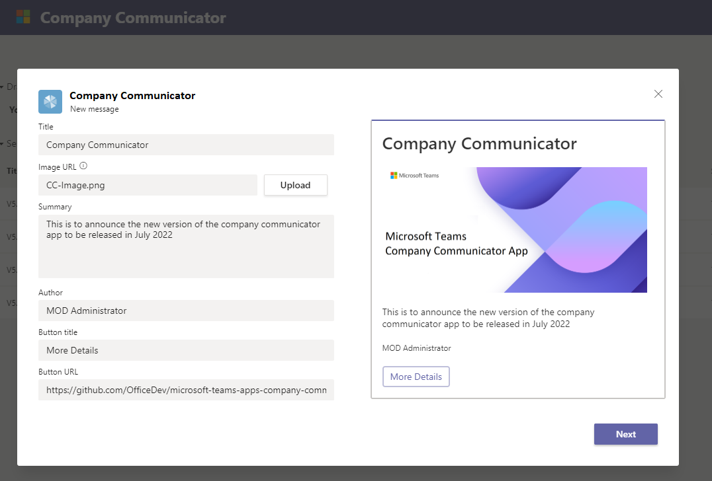

# Company Communicator

Company Communicator is a custom Teams app that enables corporate teams to create and send messages intended for multiple teams or large number of employees over chat allowing organization to reach employees right where they collaborate. Utilize this template for multiple scenarios such as new initiative announcements, employee onboarding, modern learning and development or organization-wide broadcasts.  

The app provides an easy interface for designated users to create, preview, collaborate and send messages.

It provides a foundation to build custom targeted communication capabilities such as custom telemetry on how many users acknowledged or interacted with a message.

* [Solution overview](Solution-overview)
    * [Data stores](Data-stores)
    * [Cost estimate](Cost-estimate)
    * [Known limitations](Known-limitations)
* Deploying the app
    * [Deployment guide](Deployment-guide)
    * [Troubleshooting](Troubleshooting)
* Migrating to newer version
  * [v4](v4-migration-guide)
  * [v3](v3-migration-guide)
  * [v2](v2-migration-guide)
* [Extending Company Communicator](Taking-it-further)
* [Release Notes](Release-notes)