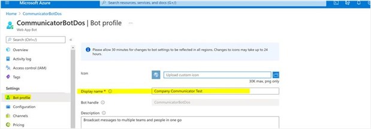

# Operational Guidance

## If we already deployed a previous version of Company Communicator, is it better to simply upgrade to the new version or “start from scratch” with a new App?

The first recommendation would be to check the [latest release notes](Release-notes.md). We recommend this as the updates between your version and the newest version may very well only be source code updates, not modifications to deployment options. If there has been modifications to the deployment options or if you want the latest features, we recommend starting fresh.

> **Please note** that if you start fresh, you will lose your previous Communicator messages. You would also need to delete your previous author app, and you would have to follow the deployment procedures again to install the App for relevant users. 

## Can we name the App something other than “Company Communicator?”

Of course! Whomever deploys the CC app can name the solution. App admins can always go back later and change the name.

 We would encourage you to not change the ID, however, so we can support you in your efforts to measure and share your impact within your organization.
 
 Please note that the App must have a globally unique name as part of the Azure services so it has a unique URL. This unique name will be separate from the name you choose for the Teams app that users will interact with. We are simply sharing so this works with your Azure naming standards, if applicable.

How to do it: Go to the Teams App Manifest and simply change the name of the app. How to do this:

1. In the Azure Bot Service: Change the mane of the bot.
2. In the Teams app manifest: Change the name of the app.

## Does a Company Communicator message have to be sent to every employee?

No, You can send it via:

### 1:1 chats to

* Everyone in the organization  
* Everyone in selected Teams
* Every member of an Office 365 groups or security groups. You can also do this by leveraging PowerShell

### Team General channels

* In the General channel of selected Teams In all above cases, the messages are received in a Team or by a user-only, and only if the Company Communicator App is installed first. 
* You cannot receive a message without the application installed. Please read through the security section and note that you can leverage our Teams App Policies (permissions and setup) to install for users.

## Can I re-use a Company Communicator message that I have already sent, later?

**Yes!**, In the admin tab, expand “sent messages” and then click on the ellipsis (“…”) and select “duplicate.” The previously sent message will now show-up as a new “draft message.”
Then you can pick them back up, whenever you like, and edit to your liking.

## Can we have more than one version of Company Communicator?

Yes, though it is important to consider your options here to (maybe) save time and confusion down the road. Here are a few ways that we have seen other organizations tackle this:

### 1. One Company Communicator App, with the following options

* Choose your audience: You do not have to send messages to everyone. You can pick and choose your audience by sending to specific Teams and/or users (or even with PowerShell scripts for the technically savvy).
* Clarify the authors: In the message authoring interface tab (see click-through demo)- before you send a message to users there is an “author” option. Clarify who your author is, as another option so users will see it in their message (e.g. "Author: HR Department").
* Complement the Company Communicator app with other solutions for department-specific announcements (e.g. Bulletins)

### 2. Two or more Company Communicator Apps

It is possible to have more than one application in your organization. We are not here to dissuade you from this option, it is a great one, but please do consider the future implications. On a related note, we have seen many customers start their Teams app journey with a bot. Once other departments use the bot, and love it .. They want one too. Rather than expanding the scope of the original bot, many organizations create .. Another bot. Again, not a bad option, but before long you could have multiple versions of the same app for different use cases. 

>In the case of Company Communicator, every App would also incur the same (additional) fixed cost as the original. Our advice would be to explore option 1 (above), first, and think through the long-term strategy here.

### 3.One version with an automated approval workflow

Selfishly, our favorite option. One of Microsoft’s Customer Success Managers built a publicly-available workflow that you can leverage with your Company Communicator App if you have multiple departments looking to send messages. Check it out here: [ https://youtu.be/pkbC7BLt4lU](https://youtu.be/pkbC7BLt4lU)

## Can Company Communicator support multi-language?

Yes:

1. The App currently supports the following locales (ar-SA, de-DE, en-US, es-ES, fr-FR, he-IL, ja-JP, ko-KR, pt-BR, ru-RU, zh-CN, zh-TW).
2. The language pack for the app manifest is not available yet, so the app will only install in English for now. Therefore, you must still update the Teams application manifest to translate the information provided in Teams App store.
3. These solutions are open source and thus any organization can, with some customization efforts, send multi-lingual messages where users can choose their preferred language.

## Can I send a message to a globally-distributed set of users and allow them to receive the message in their native language of choice?

Yes. While you can achieve this with custom development, this can also be achieved without:

1. Set criteria: If you set a criteria to identify groups of people (based on their preferred / mother language / location) – you can create or leverage Distribution Groups for different populations. (e.g. "UK headquarters")

2. Send the message in the appropriate language: Prepare a message in the desired language and target the appropriate group (reference point #1 above). The alternative is to automatically translate via our Azure cognitive services. Please consider the translation carefully as, in our experience, employees tend to prefer a personal message rather than a message has been automatically translated.

## How can I use images hosted on SharePoint Online in my adaptive cards (or at least hosted on a public endpoint)?

Adaptative cards needs the URL of the images to be publicly accessible to be displayed. Organizations can use one of the following options to achieve that:

* Move the image from SharePoint to a public location like OneDrive and create a link to share content with “Everyone” (your company policy may not authorize that) – Then open the link in a browser and “Open image in a browser” to get the direct public access to the image – As image in Adaptive cards do not exceed 1024×1024 and less then 1 MB, you can reduce the image size. Please note that this option can run into errors which have not been remediated, yet.
* Move the image from SharePoint to a public location like Azure Blob storage – An Azure Storage account is created as part of the deployment of Company Communicator and can be reused for that purpose. To upload image to an Azure Blob and get the public URL, we recommend downloading the [Azure Storage Explorer](https://azure.microsoft.com/en-us/features/storage-explorer/).

## What are the size requirements for the Adaptive Card image?

Images must be at most 1024×1024 and less then 1 MB, in PNG, JPEG, or GIF format. It is our personal experience that PNG and GIF format work best. Animated GIF is not officially supported. The image width is managed by Microsoft Teams client (web, desktop, mobile) so that it renders well on all the devices. Images are scaled up or down in size while maintaining the aspect ratio to cover the image area. Images are then cropped from center to achieve the appropriate aspect ratio for the card.

## Can I use a secure image so that the adaptive card is not using an image from a public endpoint?

Yes, we recommend choosing one of the following approaches:

1. Azure Blob Storage (covered two questions above) and generate a Shared Access Signature to append to your image URL – Azure Storage Explorer allows to set a duration to your URL but you can also generate your own SAS token to include for instance the authorized client IP ranges or a signature (HMAC) – More info here: https://docs.microsoft.com/en-us/rest/api/storageservices/create-account-sas#account-sas-uri-example 
2. DataURI. With DataURI, the image is encoded and sent directly in the content of the adaptive card – To convert an image in DataURI, you can use an online tool to convert image to DataURI – There is however a current restriction with this approach: the DataURI file size shouldn’t exceed 30kb otherwise your message can’t be saved.

## Can I send animated GIFs in the adaptive card message?

Yes, you can, however animated GIF is not officially supported by the Microsoft Teams Platform.

## As an author, do you need to be a member of the Team to send the message into the General channel of that Team?

Yes, there are 3 pre-requisites for sending out the communication:

1.	You must be part of AuthorizedCreatorsUpns configuration value in the application settings of azure app service, so that you can send out the communication from the App.
2.	Authors needs to be included in the Teams App Permission Policy that authorizes the Company Communicator Author custom app.
3.	Company Communicator Author app can only be added as tab in a Team channel. So, in order to send out communication from a Team channel, you would have to be a member or owner of that Team.
If the member or owner of Team who is not part of AuthorisedContentUPN configuration value in the application settings of azure app service will not be able to send out the communication and will get below error message
