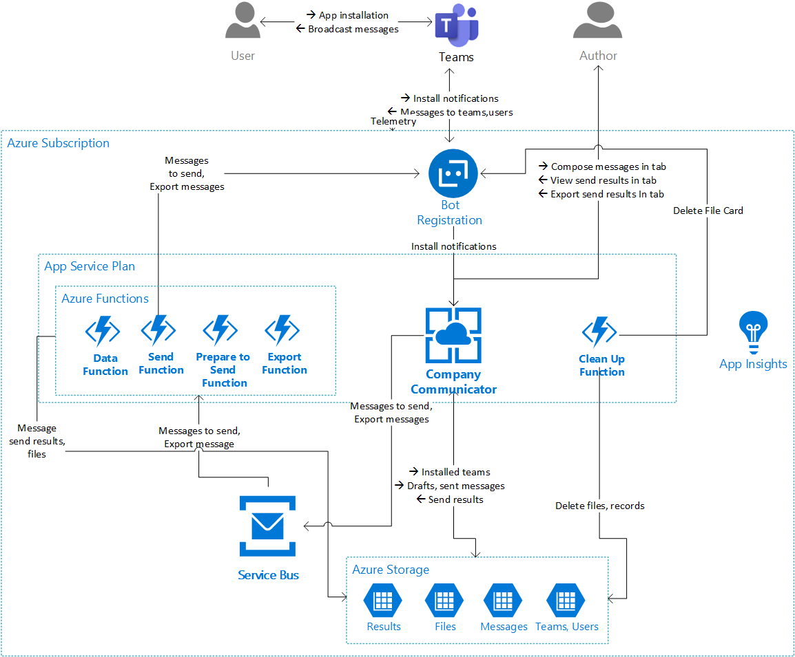

The **Company Communicator** app has the following main components:
* **App Service**: The app service implements the message compose experience in the team tab, and the messaging endpoint for the bot.
* **Service Bus**: The individual messages sent by the bot to the recipients are enqueued on a service bus queue, to be processed by an Azure Function. This queue decouples the message composition experience from the process that delivers the message to recipients.
* **Azure Function**: An Azure Function picks up the messages from the send queue and delivers them to the recipients.

## App Service

The app service implements two main components, the tab for composing messages and viewing their status, and the messaging endpoint for the bot.

### Messages tab

The messages tab is the interface by which message authors create the messages to be sent, specify the intended recipients, and initiate the send. After sending, the tab reports the status of the message delivery, as counts of deliveries that were successful, failed, or throttled.

The tab is implemneted as a React application, using UI components from [Stardust UI](https://github.com/stardust-ui/react) and [Office UI Fabric React](https://github.com/OfficeDev/office-ui-fabric-react). The message compose UX is in a [task module](https://docs.microsoft.com/en-us/microsoftteams/platform/concepts/task-modules/task-modules-overview), with a message preview implemented using the [Adaptive Cards SDK](https://docs.microsoft.com/en-us/adaptive-cards/sdk/rendering-cards/javascript/getting-started).

The tab's front-end gets its data from web APIs implemented by the same app service that's hosting it. These APIs are protected by AAD token authentication, which checks that the user attempting to access the site is in the list of valid senders.

### Bot endpoint

The app service exposes a bot messaging endpoint, which receives activities from Bot Framework as the user interacts with the app.

**conversationUpdate:** When the app is installed in team, or personally by users, the [bot is notified](https://docs.microsoft.com/en-us/microsoftteams/platform/concepts/bots/bots-notifications) via a conversationUpdate activity. The bot uses these messages to keep track of the users and teams that have installed the app:
* The list of teams is used to populate the team picker in the compose UX
* The bot tracks the Teams user ids (`29:xxx`) of the users that install the app, so that it can broadcast messages to them. [Proactive messaging in Teams](https://docs.microsoft.com/en-us/microsoftteams/platform/concepts/bots/bot-conversations/bots-conv-proactive) requires the bot to know this unique ID, which otherwise cannot be derived from their AAD ID or UPN.

**messageReaction:** When the user reacts to a message sent by the bot, Teams sends the bot a `messageReaction` [event](https://docs.microsoft.com/en-us/microsoftteams/platform/concepts/bots/bots-notifications#reactions). We don't use this information in the initial version, we plan to do so in the future.

## Azure Function

Company Communicator uses two Azure Functions:

### Send function

This function is executed on each message in the "send" Service Bus queue, which contains the delivery information for each recipient. The function will:
1. Get an access token for the bot, if needed.
2. Construct the message to send, based on the message ID.
3. If the recipient is an individual user, check if we have a known 1:1 conversation with them. If not, create a conversation and update the user record with the conversation ID. (We cache the conversation ID so we don't need to create it repeatedly.)
4. Send the message to the recipient.
5. Store the outcome of the delivery in an Azure table.

### Data aggregation function

An instance of this function runs every 30 seconds, while the app is actively delivering messages. For each message that's currently in the sending state, the data aggregation function checks the delivery records created by the Send fuction, and updates the success, failure, and throttle counts, so that the information shown in the tab is up-to-date.
