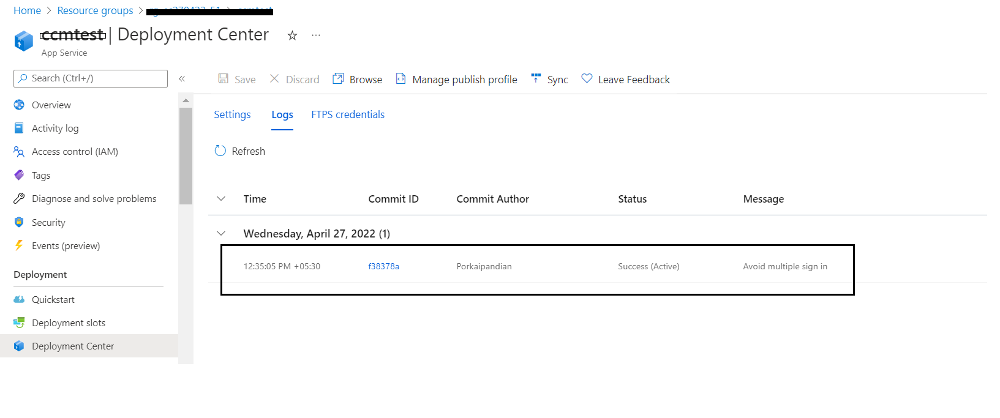

# General template issues

## Generic possible issues
There are certain issues that can arise that are common to many of the app templates. Please check [here](https://github.com/OfficeDev/microsoft-teams-stickers-app/wiki/Troubleshooting) for reference to these.

# Problems deploying to Azure

## 1. Code deployment failure
```
{
    "id": "/subscriptions/<subscription-id>/resourceGroups/<resource-group>/providers/Microsoft.Resources/deployments/Microsoft.Template/operations/E46C6DE7BE4DE2F9",
    "operationId": "E46C6DE7BE4DE2F9",
    "properties": {
        "provisioningOperation": "Create",
        "provisioningState": "Failed",
        "timestamp": "2019-08-19T19:42:57.0367572Z",
        "duration": "PT22M52.4117137S",
        "trackingId": "8ca12d86-552a-402d-8b06-4fc8fb450bbb",
        "statusCode": "Conflict",
        "statusMessage": {
            "status": "Failed",
            "error": {
                "code": "ResourceDeploymentFailure",
                "message": "The resource operation completed with terminal provisioning state 'Failed'."
            }
        },
        "targetResource": {
            "id": "/subscriptions/<subscription-id>/resourceGroups/<resource-group>/providers/Microsoft.Web/sites/<resource-name>/sourcecontrols/web",
            "resourceType": "Microsoft.Web/sites/sourcecontrols",
            "resourceName": "<resource-name>/web"
        }
    }
}
```
The resource type `Microsoft.Web/sites/sourcecontrols` failed to deploy. The transitive dependency set of the front-end web app pulls in over 1,000 NPM packages, and sometimes there is an error fetching all of the packages.

#### Fix

1. Go to the "Deployment center" section of the app service that failed to deploy.
2. Click on "Sync" to restart the deployment.

If you had to do this, you may not have received the **authorBotId**, **userBotId** and **appDomain** values at the end of the deployment. To find them, go to the "Configuration" section of your Web App.

* **authorBotId:** This is the author Microsoft Application ID for the Company Communicator app. It can be found in the "AuthorAppId" field of your configuration e.g. 5630f8a2-c2a0-4cda-bdfa-c2fa87654321. For the following steps, it will be referred to as %authorBotId%.
* **userBotId:** This is the user Microsoft Application ID for the Company Communicator app. It can be found in the "UserAppId" field of your configuration e.g. 5630f8a2-c2a0-4cda-bdfa-c2fa87654321. For the following steps, it will be referred to as %userBotId%.
* **appDomain:** This is the base domain for the Company Communicator app. It is the value in the "AzureAd:ApplicationIdURI" field of your configuration without the "api://" e.g. appName.azurefd.net. For the following steps, it will be referred to as %appDomain%.

We are currently looking into how to make this process more resilient to intermittent failures.


## 2. App Deployment failure - RoleAssignmentUpdateNotPermitted
Error Logs: 
```
{ 
"code": "DeploymentFailed", 
"message": "At least one resource deployment operation failed. Please list deployment operations for details. Please see https://aka.ms/DeployOperations for usage details.", 
"details": [ 
{ 
"code": "RoleAssignmentUpdateNotPermitted", 
"message": "Tenant ID, application ID, principal ID, and scope are not allowed to be updated." 
}, 
```
#### Fix
This issue occurs when attempting multiple deployments with the same GUID. As per suggestion it is recommended to have new GUID’s generated for each deployment.

1. Go to the Azure portal and delete the existing resources.
2. Update the below fields with newly generated valid GUIDs during the re-deployment. Any online tool can be used to generate a valid GUID. 


## 3. Send in chat to members of the following M365 groups, Distribution groups or Security groups option is Disabled.

#### Fix

Verify if the below permissions has been added to the graph app registration and the admin consent is granted.

1. Delegated permissions
    * GroupMember.Read.All
    * AppCatalog.Read.All
    * User.Read

2. Application permissions
    * GroupMember.Read.All
    * User.Read.All
    * TeamsAppInstallation.ReadWriteForUser.All


## 4. Multiple instance of Company Communicator in the same tenant action items.

#### Steps

To deploy the second instance of company communicator in single-tenant

1. Register Azure AD Applications as mentioned in Step 1 of [Deployment Guide](https://github.com/OfficeDev/microsoft-teams-apps-company-communicator/wiki/Deployment-guide).
2. While doing ARM Template deployment, update “User App External Id” with following different value example: `148a66bb-e83d-425a-927d-09f4299a9275`
3. Update the below fields with newly generated valid GUIDs during the re-deployment. Any online tool can be used to generate a valid GUID. 


4. Proceed with remaining steps 3, 4 of [Deployment Guide](https://github.com/OfficeDev/microsoft-teams-apps-company-communicator/wiki/Deployment-guide).
5. In Step 5, Please update user app manifest id from `148a66bb-e83d-425a-927d-09f4299a9274` to `148a66bb-e83d-425a-927d-09f4299a9275` and please update author app manifest id from `1c07cd26-a088-4db8-8928-ace382fa219f` to `1c07cd26-a088-4db8-8928-ace382fa219d` (Different value)
and proceed with the remaining steps as mentioned in deployment guide.

If you miss updating “User App External Id” in step 2, you can update the value in the following sections:

* Go to second instance azure resource group. Open the App service and click on Configuration (in left navigation). Update “UserAppExternalId” value to `148a66bb-e83d-425a-927d-09f4299a9275`. Click on “ok” and then on “save” and restart app service.

* Go to second instance azure resource group. Open function app which is ending with “-prep-function” and click on Configuration (in left navigation).Update the“UserAppExternalId” value to `148a66bb-e83d-425a-927d-09f4299a9275`. Click on “ok” and the on “save” and restart function app.

## 5. App service Sync throws npm error

Error Logs: 
```
react-scripts' is not recognized as an internal or external command,
operable program or batch file.
npm ERR! code ELIFECYCLE
Failed exitCode=1, command=npm run build
npm ERR! errno 1
An error has occurred during web site deployment.
npm ERR! company-communicator@4.1.5 build: react-scripts build
npm ERR! Exit status 1
npm ERR!
npm ERR! Failed at the company-communicator@4.1.5 build script.
npm ERR! This is probably not a problem with npm. There is likely additional logging output above 
```
#### Fix
This issue occurs when attempting multiple times node modules are installed by changing the branch endpoint.

1. Go to the Deployment center. Click on Disconnect.


2. Wait for 5 to 10 minutes until the entry under the **Logs** tab will be deleted automatically.



3. Once the disconnection is completed. Go to Settings and select External Git and add below URL and branch name.
    
    * Repository : https://github.com/OfficeDev/microsoft-teams-apps-company-communicator.git
    * Branch     : main (If you are using older version of CC, please select the branch name accordingly.)

    


## 6. Proactive app installation is not working
If proactive app installation for a user is not working as expected, make sure you have performed the following:

1. Grant Admin consent to the application for all the graph permissions mentioned [here](https://github.com/OfficeDev/microsoft-teams-company-communicator-app/wiki/Deployment-guide#4-add-permissions-to-your-app).
2. "ProactivelyInstallUserApp" configuration is enabled (set to "true") for the web app and the prep-function.
3. "UserAppExternalId" configuration matches with the User app Id (in the Teams App manifest) for the web app.
4. [Upload](https://docs.microsoft.com/en-us/microsoftteams/tenant-apps-catalog-teams) the User app to your tenant's app catalog so that it is available for everyone in your tenant to install.

## 7. ARM template deployment timeout/error message
If you encounter the following error message while deploying with the PowerShell script. This is expected and the script will recover from this failure automatically.


## 8. Cannot find any Teams or Teams Users in the dropdown while sending the message.

#### Fix
Teams only show up when the user app is installed to specific Teams in the tenant.

1. Click on the User App and Add to Specific Teams.


## 9. User is getting DeltaLink older than 30 days is not supported error.

#### Fix
This issue occurs when attempting multiple times node modules are insatlled by changing the branch endpoint.

1. Go to Resource Group which was created and then to to storage account.

2. Click on storage preview. Expand **Tables** section

3. Open **UserData** table. Remove the last record where RowKey is entered as	**AllUSersDeltaLink**.
    

    

4. Restart all the services.


## 10. Owners of the Teams aren't getting broadcasts messages.

When sending chat to 'members of following teams' or 'members of M365 groups' people who are listed as owners of those groups and not members are not getting broadcasts.

#### Fix
Teams only show up when the user app is installed to specific Teams in the tenant.

1. If you are sending the message to teams channel, both members and owner will be receiving the message.

2. For distribution lists(DL) and MS365, only the members will receive the message but not the owner.

The workaround is to add the owners email to the members list so that they will be able to receive the messages.


## 11. Error when attempting to reuse a Microsoft Azure AD application ID for the bot registration
```
Bot is not valid. Errors: The Microsoft App ID is already registered to another bot application.. See https://aka.ms/bot-requirements for detailed requirements.
```

* Creating the resource of type Microsoft.BotService/botServices failed with status "BadRequest"

This happens when the Microsoft Azure application ID entered during the setup of the deployment has already been used and registered for a bot, for instance, if a previous deployment step failed **after** the bot was created.

#### Fix
Either register a new Microsoft Azure AD application or delete the bot registration that is currently using the attempted Microsoft Azure application ID.

## 12. Forgetting the botId or appDomain
If you forgot to copy your **authorBotId**, **userBotId** and **appDomain** values from the end of the deployment. You can find them in the "Configuration" section of your Web App.

* **authorBotId:** This is the author Microsoft Application ID for the Company Communicator app. It can be found in the "AuthorAppId" field of your configuration e.g. 5630f8a2-c2a0-4cda-bdfa-c2fa87654321. For the following steps, it will be referred to as %authorBotId%.
* **userBotId:** This is the user Microsoft Application ID for the Company Communicator app. It can be found in the "UserAppId" field of your configuration e.g. 5630f8a2-c2a0-4cda-bdfa-c2fa87654321. For the following steps, it will be referred to as %userBotId%.
* **appDomain:** This is the base domain for the Company Communicator app. It is the value in the "AzureAd:ApplicationIdURI" field of your configuration without the "api://" e.g. appName.azurefd.net. For the following steps, it will be referred to as %appDomain%.

## 13. App service deployment fails with the error message "Input string was not in a correct format" due to fsevents package.
App Service deployment failed recently due to deprecation of package version used in the application, the issue is already fixed and released to GitHub. However, if you've performed the deployment already and wanted to fix the failed deployment, then use the below mentioned work around.

#### Fix

- Go to portal.azure.com. Navigate to resource group where all CC resources are deployed.
- Click on the app service -> click on Configuration
- Click on **WEBSITE_NODE_DEFAULT_VERSION.**
- Update the default value to **16.13.0** (previous value -> 10.15.2) and save.
- Click on overview and re-start the app service.
- Once the app service is restarted, navigate to Deployment Center and click on Sync.
- Wait till the deployment is completed. You can validate this once the status changes to Success under logs. 

# Didn't find your problem here?
Please report the issue [here](https://github.com/OfficeDev/microsoft-teams-company-communicator-app/issues/new)


