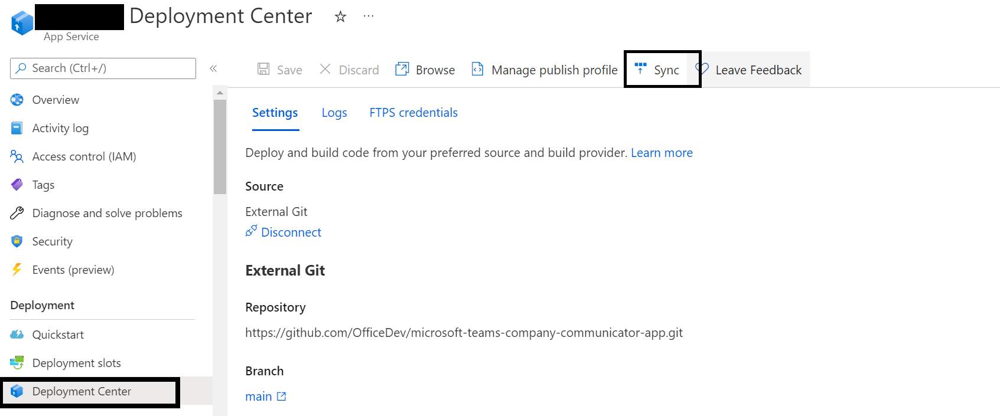

# General template issues

## Generic possible issues
There are certain issues that can arise that are common to many of the app templates. Please check [here](https://github.com/OfficeDev/microsoft-teams-stickers-app/wiki/Troubleshooting) for reference to these.

# Problems deploying to Azure

## 1. Code deployment failure
```
{
    "id": "/subscriptions/<subscription-id>/resourceGroups/<resource-group>/providers/Microsoft.Resources/deployments/Microsoft.Template/operations/E46C6DE7BE4DE2F9",
    "operationId": "E46C6DE7BE4DE2F9",
    "properties": {
        "provisioningOperation": "Create",
        "provisioningState": "Failed",
        "timestamp": "2019-08-19T19:42:57.0367572Z",
        "duration": "PT22M52.4117137S",
        "trackingId": "8ca12d86-552a-402d-8b06-4fc8fb450bbb",
        "statusCode": "Conflict",
        "statusMessage": {
            "status": "Failed",
            "error": {
                "code": "ResourceDeploymentFailure",
                "message": "The resource operation completed with terminal provisioning state 'Failed'."
            }
        },
        "targetResource": {
            "id": "/subscriptions/<subscription-id>/resourceGroups/<resource-group>/providers/Microsoft.Web/sites/<resource-name>/sourcecontrols/web",
            "resourceType": "Microsoft.Web/sites/sourcecontrols",
            "resourceName": "<resource-name>/web"
        }
    }
}
```
The resource type `Microsoft.Web/sites/sourcecontrols` failed to deploy. The transitive dependency set of the front-end web app pulls in over 1,000 NPM packages, and sometimes there is an error fetching all of the packages.

#### Fix

1. Go to the "Deployment center" section of the app service that failed to deploy.
2. Click on "Sync" to restart the deployment.

If you had to do this, you may not have received the **authorBotId**, **userBotId** and **appDomain** values at the end of the deployment. To find them, go to the "Configuration" section of your Web App.

* **authorBotId:** This is the author Microsoft Application ID for the Company Communicator app. It can be found in the "AuthorAppId" field of your configuration e.g. 5630f8a2-c2a0-4cda-bdfa-c2fa87654321. For the following steps, it will be referred to as %authorBotId%.
* **userBotId:** This is the user Microsoft Application ID for the Company Communicator app. It can be found in the "UserAppId" field of your configuration e.g. 5630f8a2-c2a0-4cda-bdfa-c2fa87654321. For the following steps, it will be referred to as %userBotId%.
* **appDomain:** This is the base domain for the Company Communicator app. It is the value in the "AzureAd:ApplicationIdURI" field of your configuration without the "api://" e.g. appName.azurefd.net. For the following steps, it will be referred to as %appDomain%.

We are currently looking into how to make this process more resilient to intermittent failures.


## 2. Forgetting the botId or appDomain
If you forgot to copy your **authorBotId**, **userBotId** and **appDomain** values from the end of the deployment. You can find them in the "Configuration" section of your Web App.

* **authorBotId:** This is the author Microsoft Application ID for the Company Communicator app. It can be found in the "AuthorAppId" field of your configuration e.g. 5630f8a2-c2a0-4cda-bdfa-c2fa87654321. For the following steps, it will be referred to as %authorBotId%.
* **userBotId:** This is the user Microsoft Application ID for the Company Communicator app. It can be found in the "UserAppId" field of your configuration e.g. 5630f8a2-c2a0-4cda-bdfa-c2fa87654321. For the following steps, it will be referred to as %userBotId%.
* **appDomain:** This is the base domain for the Company Communicator app. It is the value in the "AzureAd:ApplicationIdURI" field of your configuration without the "api://" e.g. appName.azurefd.net. For the following steps, it will be referred to as %appDomain%.


## 3. Error when attempting to reuse a Microsoft Azure AD application ID for the bot registration
```
Bot is not valid. Errors: The Microsoft App ID is already registered to another bot application.. See https://aka.ms/bot-requirements for detailed requirements.
```

* Creating the resource of type Microsoft.BotService/botServices failed with status "BadRequest"

This happens when the Microsoft Azure application ID entered during the setup of the deployment has already been used and registered for a bot, for instance, if a previous deployment step failed **after** the bot was created.

#### Fix
Either register a new Microsoft Azure AD application or delete the bot registration that is currently using the attempted Microsoft Azure application ID.

## 4. Proactive app installation is not working
If proactive app installation for a user is not working as expected, make sure you have performed the following:

1. Grant Admin consent to the application for all the graph permissions mentioned [here](https://github.com/OfficeDev/microsoft-teams-company-communicator-app/wiki/Deployment-guide#4-add-permissions-to-your-app).
2. "ProactivelyInstallUserApp" configuration is enabled (set to "true") for the web app and the prep-function.
3. "UserAppExternalId" configuration matches with the User app Id (in the Teams App manifest) for the web app.
4. [Upload](https://docs.microsoft.com/en-us/microsoftteams/tenant-apps-catalog-teams) the User app to your tenant's app catalog so that it is available for everyone in your tenant to install.

## 5. ARM template deployment timeout/error message
If you encounter the following error message while deploying with the PowerShell script. This is expected and the script will recover from this failure automatically.


## 6. Unable to sign-in after upgrading the Company Communicator from a version prior to v4.
Go to the tenant where app is installed and open **Enterprise Applicationss** page [here](https://portal.azure.com/#blade/Microsoft_AAD_IAM/ActiveDirectoryMenuBlade/EnterpriseApps) and search for the app you created in Company Communicator v3.
1. Under **Manage**, click on **Properties** and then **Delete**.


## 7. When upgrading Company Commmunicator from a version prior to v4, please ensure that the **users** app is installed in the teams to send messages to the team or its members.
Install the **User** app (the `company-communicator-users.zip` package) to the teams that will be the target audience.

# Didn't find your problem here?
Please report the issue [here](https://github.com/OfficeDev/microsoft-teams-company-communicator-app/issues/new)
