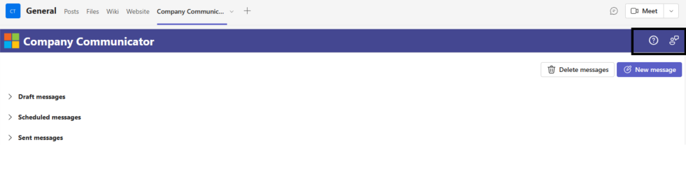
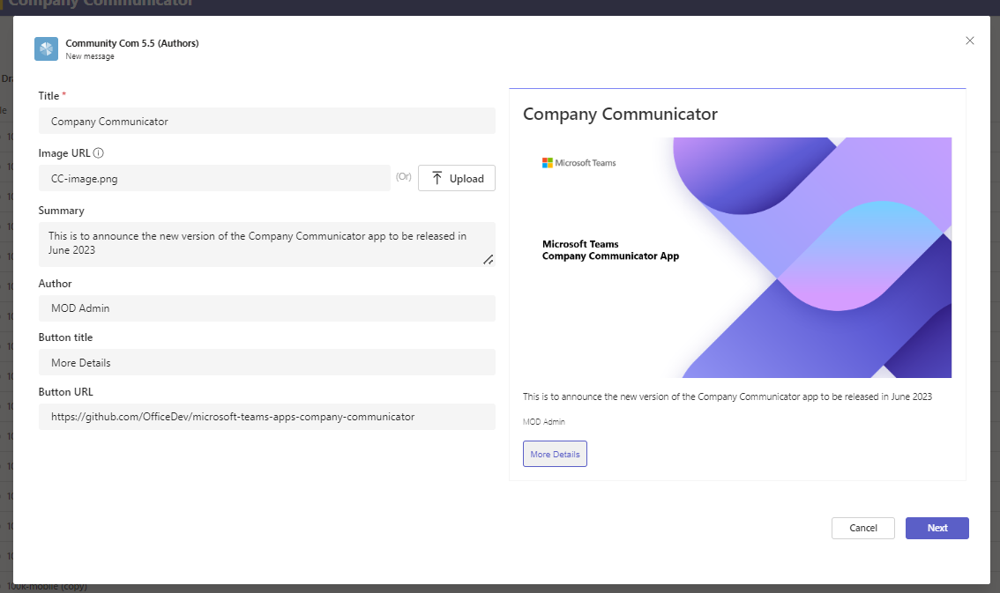
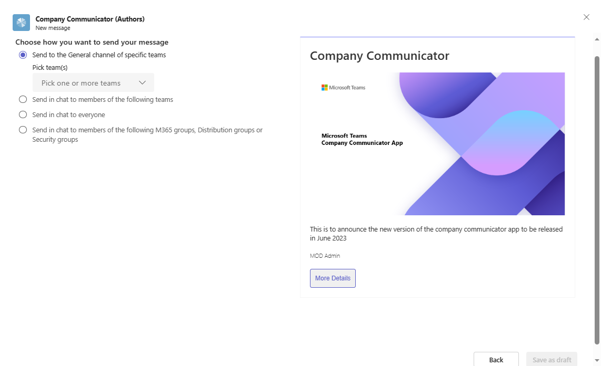
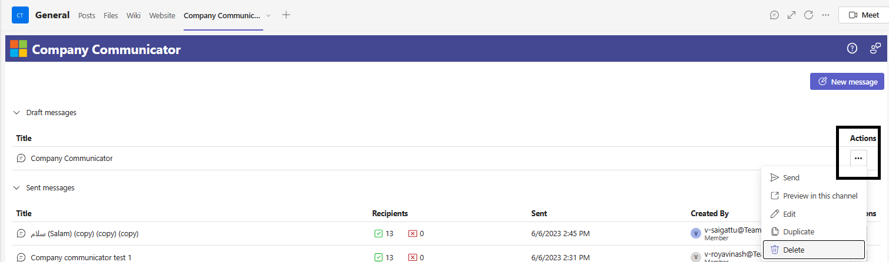
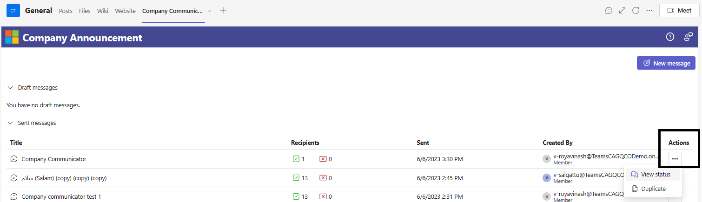

# User Manual

You can find the detailed information on the features available in Company Communicator app in this section.

## Header

From Company Communicator v5.2, new banner added to the application, below options available in this banner,

- **Logo:** Default will be Microsoft logo, to update to your organization logo, refer to FAQ section.
- **Header Text:** Default will be Company Communicator, to update the text refer to FAQ section.
- **Support:** Redirects user to GitHub repo to raise issues.
- **Feedback:** Share your feedback and features directly to the product team.

    

## Send Message

### New Message

Click 'New Message' to draft the message to be sent,

- **Title:**  Title of the message in few words.
- **Image URL:**  The image to be attached to the message, they are 2 ways the image can be attached.
    1. Click 'Upload' button and select the image from the local machine, image should not be more than ~1 MB in size
    1. Upload the image to public site and paste the image URL in the field, remember the URL should be publicly accessible
- **Summary:**  You can provide the summary of the message, you can also format the message using markdown tags, refer [here](https://docs.microsoft.com/en-us/adaptive-cards/authoring-cards/text-features) to know the list of styles supported. 
- **Author:** Name of the author who sends the message.
- **Button Title:** Name of the button if you want the user to redirect to some other page.
- **Button URL:**  URL of the page where user can be directed.

    

### Send Options

- Company Communicator provides below 4 options to the author to send the message,
    1. **Send to General channel** - Send the message to the general channel of the selected Teams
    1. **Send in chat to members** - Send the message to the individual members as personal chat of the selected Teams
    1. **Send in chat to everyone** - Send the message to all the users in the organization who have access to the user app
    1. **Send in chat to members using groups** - Send the message to the users using M365 groups, Distribution groups or Security groups

        

- Click on 'Save as draft', the message title will appear in the 'Draft messages' section

### Draft Messages

All the draft messages will appear in this section. Each draft message has the following options,

- **Send:**  Send the message to the users/Teams.
- **Preview:** Author can preview how the message will appear when delivered, this will get posted in the General channel. 
- **Edit:** Edit the current message available in draft.
- **Duplicate:** Creates a copy of the same message card.
- **Delete:** Delete the message if it's no longer needed. 

    

### Sent Messages

All the sent messages will appear in this section along with the recipients success and failure counts, date when the messages sent. Each sent message has the following options,

- **View Status:** Shows the details on the time duration to send the message, success and failure counts, notified Teams/groups etc.
    - **Export detailed results:** Click on 'Export the detailed results' button, the data will be exported to excel file, you'll be notified once the file is ready to download.
- **Duplicate:** Creates a copy of the same sent message card.
- **Cancel:** Cancel sending the message to the users.

    
