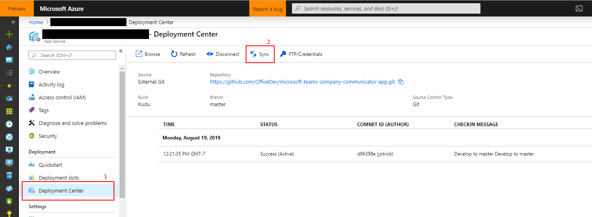

## Company Communicator v2 Migration Guide

## Upgrading from v1.x to v2
If you have the CCv1 deployed and plan to migrate to CCv2, perform the following steps:

### 1. Read CCv1 deployment parameters:
Copy all the parameters from the previous deployment (CCv1), and make sure you have the following:
  * Name of the Azure subscription.
  * Name of the Azure resource group.
  * Base resource name.
  * Bot tenant ID.
  * Bot client ID.
  * Bot client secret.
  * Sender UPN list.

We will use them in the next steps.

Please refer [step 2](https://github.com/OfficeDev/microsoft-teams-company-communicator-app/wiki/Deployment-guide) in the Deployment guide for more details about the above values.

### 2. Deploy to your Azure subscription

1. Click on the **Deploy to Azure** button below.
   
   

2. When prompted, log in to your Azure subscription.
    > Please use the same subscription being used for your Company Communicator v1 deployment (from step 1).

3. Azure will create a "Custom deployment" based on the Company Communicator ARM template and ask you to fill in the template parameters.

    > **Note:** Please ensure that you don't use underscore (_) or space in any of the field values otherwise the deployment may fail.

4. Select a subscription and a resource group.
    > Please use the same `subscription`, `resource group` being used for your Company Communicator v1 deployment. (from step 1)

5. Enter a **Base Resource Name**.
    > Please use the same `Base resource name` being used for your Company Communicator v1 deployment. (from step 1)

6. Update the following fields in the template:
    1. **Bot Client ID**: The application (client) ID of the Microsoft Teams bot app. (from Step 1)
    2. **Bot Client Secret**: The client secret of the Microsoft Teams bot app. (from Step 1)
    3. **Tenant Id**: The tenant ID. (from Step 1)

    > **Note:** For ids, make sure that the values are copied as-is, with no extra spaces. The template checks that GUIDs are exactly 36 characters.

7. Fill in the "Sender UPN List", which is a semicolon-delimited list of users who will be allowed to send messages using Company Communicator.
    * For example, to allow Megan Bowen (meganb@contoso.com) and Adele Vance (adelev@contoso.com) to send messages, set this parameter to `meganb@contoso.com;adelev@contoso.com`.
    * You can change this list later by going to the app service's "Configuration" blade.

8. Agree to the Azure terms and conditions by clicking on the check box "I agree to the terms and conditions stated above" located at the bottom of the page.

9. Click on "Purchase" to start the deployment.

10. Wait for the deployment to finish. You can check the progress of the deployment from the "Notifications" pane of the Azure Portal. It can take **up to an hour** for the deployment to finish.

    > If the deployment fails, see [this section](https://github.com/OfficeDev/microsoft-teams-company-communicator-app/wiki/Troubleshooting#1-code-deployment-failure) of the Troubleshooting guide.

11. Then go to the "Deployment Center" section of the app service. Click on the "Sync" to update the existing app service to the latest code in the GitHub repository.

  

12. Please repeat the above step (step 11) for the function apps.

### 3. Assign Permissions to your app

1. Go to the **App Registrations** page [here](https://portal.azure.com/#blade/Microsoft_AAD_IAM/ActiveDirectoryMenuBlade/RegisteredApps).

2. Select **API Permissions** blade from the left hand side.

3. Click on **Add a permission** button to add permission to your app.

4. In Microsoft APIs under Select an API label, select the particular service and give the following permissions,

    * Under “Commonly used Microsoft APIs”,
    
    * Select “Microsoft Graph”, then select **Delegated permissions** and check the following permissions,
      1. **Group.Read.All**

    * Then select **Application permissions** and check the following permissions,
      1. **Group.Read.All**
      2. **User.Read.All**

    * Click on **Add Permissions** to commit your changes.

    > Please refer to [Solution overview](https://github.com/OfficeDev/microsoft-teams-company-communicator-app/wiki/Solution-overview#microsoft-graph-api) for more details about the above permissions.

5. If you are logged in as the Global Administrator, click on the “Grant admin consent for %tenant-name%” button to grant admin consent, else inform your Admin to do the same through the portal.
    
   Alternatively you may follow the steps below:
   - Prepare link - https://login.microsoftonline.com/common/adminconsent?client_id=%appId%. Replace the `%appId%` with the `Application (client) ID` of Microsoft Teams bot app (from above).
   - Global Administrator can grant consent using the link above.

### 4. Update the Teams app package

You need to only update the author's team package.

  1. Open the `Manifest\manifest_authors.json` file in a text editor.

  2. Change the value of `supportFiles` from `false` to `true`.

  > Please refer to step 5 in the Deployment guide for more details on creating the 
  Teams app package 
  [this section](https://github.com/OfficeDev/microsoft-teams-company-communicator-app/wiki/Deployment-guide).

  > Please refer to 
  [this link](https://docs.microsoft.com/en-us/microsoftteams/manage-apps#upload-a-new-app) 
  to update the app package.

### 5. The migration is done once the deployment completed.
No need to change either AAD App Registration. It is pretty strait-forward. 
