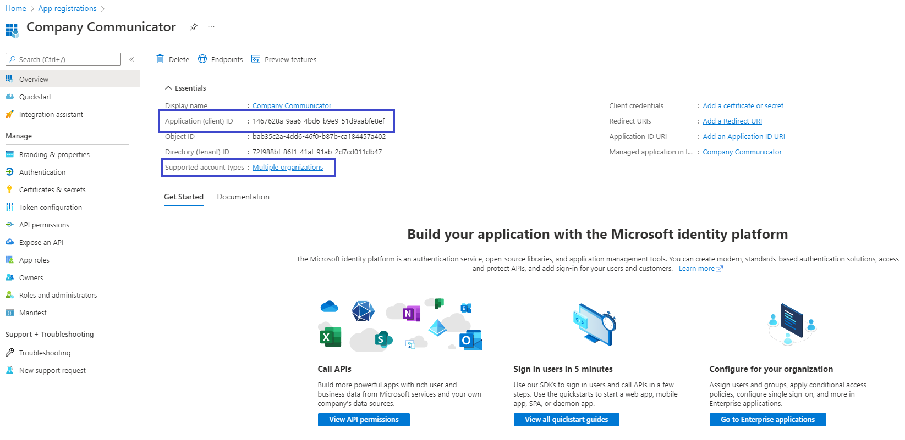

## Company Communicator v5 Migration Guide

## Upgrading from v4 to v5
If you have the CCv4 deployed and plan to migrate from CCv4 to CCv5, perform the following steps:

### 1. Read CCv4 deployment parameters:
Copy all the parameters from the previous deployment (CCv4), and make sure you have the following:
  * Name of the Azure subscription.
  * Name of the Azure resource group.
  * Base resource name.
  * Bot tenant ID.
  * User bot client ID.
  * User bot client secret.
  * Author bot client ID.
  * Author bot client secret.
  * Sender UPN list.

We will use them in the next steps.

Please refer [step 2](https://github.com/OfficeDev/microsoft-teams-company-communicator-app/wiki/Deployment-guide) in the Deployment guide for more details about the above values.

### 2. Register Azure AD application.
1. Register an Azure AD application in your tenant's directory where app is being used.

2. Log in to the Azure Portal for your subscription, and go to the [App registrations](https://portal.azure.com/#blade/Microsoft_AAD_IAM/ActiveDirectoryMenuBlade/RegisteredApps) blade.

3. Go to **App Registrations** page [here](https://portal.azure.com/#blade/Microsoft_AAD_IAM/ActiveDirectoryMenuBlade/RegisteredApps) and open the User Bot Azure AD app from the application list. 

4. Under **Manage**, click on **Branding**.
    1. Add ` Users` at the end of existing Name.

    1. Click **Save** to commit your changes.

5. Click **New registration** to create an Azure AD application.
    - **Name**: Name of your Teams App - if you are following the template for a default deployment, we recommend "Company Communicator App".
    - **Supported account types**: Select "Accounts in this organizational directory only(Default Directory only - Single tenant)".
    - Leave the "Redirect URI" field blank for now.

    

6. Click **Register** to complete the registration.

7. When the app is registered, you'll be taken to the app's "Overview" page. Copy the **Application (client) ID**; we will need it later. Verify that the "Supported account types" is set to **Multiple organizations**.

    

8. On the side rail in the Manage section, navigate to the "Certificates & secrets" section. In the Client secrets section, click on "+ New client secret". Add a description for the secret, and choose when the secret will expire. Click "Add".

    

9. Once the client secret is created, copy its **Value**; we will need it later.


### 3. Clean the Company Communicator v4 author app registration

1. Go to **App Registrations** page [here](https://portal.azure.com/#blade/Microsoft_AAD_IAM/ActiveDirectoryMenuBlade/RegisteredApps) and open the author app you created in Company Communicator v4(in Step 1).

1. Under **Manage**, click on **Authentication** to bring up authentication settings.

    1. Delete the entry to **Redirect URIs**.

    1. Under **Implicit grant**, un-check **ID tokens**.

    1. Click **Save** to commit your changes.

1. Back under **Manage**, click on **Expose an API**.This step is to remove the registered domain from current registration so that it can be migrated to graph app registration. Please follow the below steps as per the order mentioned.

    1. First, delete the list of Authorized client applications. 

    1. Then, click on the scope defined and disable the scope. Click on Save to commit your changes.

    1. Now, click on the scope defined and then click on Delete.

    1. Then, to delete the **Application ID URI** there are multiple steps involved. The steps will involve delete and update operation to completely remove the **Application ID URI** from the current Azure AD object Id.
    
    1. Delete the **Application ID URI**.
    
    1. Click on the Set **Application ID URI** and then Click on Save.
    
    1. Click **Save** to commit your changes.

1. Back under **Manage**, click on **Manifest**.

   1. In the editor that appears, find the `optionalClaims` property in the JSON Azure AD application manifest, and replace it with the following block:

   ```
   "optionalClaims": null,
   ```

   1. Click **Save** to commit your changes.

1. Select **API Permissions** blade from the left hand side.

    1. Click on **Group.Read.All** permission and then click on remove permission.
     

    1. Repeat the same for other permissions. Note: Do not delete the **User.Read** permission.

### 4. Deploy to your Azure subscription
1. Click on the **Deploy to Azure** button below.
   
   [](https://portal.azure.com/#create/Microsoft.Template/uri/https%3A%2F%2Fraw.githubusercontent.com%2FOfficeDev%2Fmicrosoft-teams-company-communicator-app%2Fmain%2FDeployment%2Fazuredeploy.json)

1. When prompted, log in to your Azure subscription.
    > Please use the same subscription being used for your Company Communicator v4 deployment (from step 1).

1. Azure will create a "Custom deployment" based on the Company Communicator ARM template and ask you to fill in the template parameters.

    > **Note:** Please ensure that you don't use underscore (_) or space in any of the field values otherwise the deployment may fail.

1. Select a subscription and a resource group.
   > Please use the same `subscription`, `resource group` being used for your Company Communicator v4 deployment. (from step 1)

1. Enter a **Base Resource Name**, which the template uses to generate names for the other resources.
   > Please use the same `Base resource name` being used for your Company Communicator v4 deployment. (from step 1)

1. Update the following fields in the template:
    1. **User Client ID**: The application (client) ID of the Microsoft Teams user bot app. (from Step 1)
    2. **User Client Secret**: The client secret of the Microsoft Teams user bot app. (from Step 1)
    3. **Tenant Id**: The tenant ID. (from Step 1)
    4. **Author Client ID**: The application (client) ID of the Microsoft Teams author bot app. (from Step 1)
    5. **Author Client Secret**: The client secret of the Microsoft Teams author bot app. (from Step 1)
    6. **Microsoft Graph App Client ID**: The application (client) ID of the Microsoft Graph Azure AD app. (from Step 2)
    7. **Microsoft Graph App Secret**: The client secret of the Microsoft Graph Azure AD app. (from Step 2)
    8. **Proactively Install User App [Optional]**: Default value is `true`. You may set it to `false` if you want to disable the feature.
    9. **User App ExternalId [Optional]**: Default value is `148a66bb-e83d-425a-927d-09f4299a9274`. This **MUST** be the same `id` that is in the Teams app manifest for the user app.
     10. **Service Bus Web App Role Name Guid [Optional]**: Default value is `958380b3-630d-4823-b933-f59d92cdcada`. This **MUST** be the same `id` per app deployment.
   
        > **Note:** Make sure to keep the same values for an upgrade. Please change the role name GUIDs in case of another Company Communicator Deployment in same subscription.

    11. **Service Bus Prep Func Role Name Guid [Optional]**: Default value is `ce6ca916-08e9-4639-bfbe-9d098baf42ca`. This **MUST** be the same `id` per app deployment.
    12. **Service Bus Send Func Role Name Guid [Optional]**: Default value is `960365a2-c7bf-4ff3-8887-efa86fe4a163`. This **MUST** be the same `id` per app deployment.
    13. **Service Bus Data Func Role Name Guid [Optional]**: Default value is `d42703bc-421d-4d98-bc4d-cd2bb16e5b0a`. This **MUST** be the same `id` per app deployment.
    14. **Storage Account Web App Role Name Guid [Optional]**: Default value is `edd0cc48-2cf7-490e-99e8-131311e42030`. This **MUST** be the same `id` per app deployment.
    15. **Storage Account Prep Func Role Name Guid [Optional]**: Default value is `9332a9e9-93f4-48d9-8121-d279f30a732e`. This **MUST** be the same `id` per app deployment.
    16. **Storage Account Data Func Role Name Guid [Optional]**: Default value is `5b67af51-4a98-47e1-9d22-745069f51a13`. This **MUST** be the same `id` per app deployment.
    17. **DefaultCulture [Optional]**: By default the application uses `en-US` locale. You can choose the locale from the list, if you wish to use the app in different locale.Also, you may add/update the resources for other locales and update this configuration if desired.
    18. **SupportedCultures [Optional]**: This is the list of locales that application supports currently.You may add/update the resources for other locales and update this configuration if desired.


    > **Note:** Make sure that the values are copied as-is, with no extra spaces. The template checks that GUIDs are exactly 36 characters.

    > **Note:** If your Azure subscription is in a different tenant than the tenant where you want to install the Teams App, please update the `Tenant Id` field with the tenant where you want to install the Teams App.

1. Update the "Sender UPN List", which is a semicolon-delimited list of users (Authors) who will be allowed to send messages using the Company Communicator.
    * For example, to allow Megan Bowen (meganb@contoso.com) and Adele Vance (adelev@contoso.com) to send messages, set this parameter to `meganb@contoso.com;adelev@contoso.com`.
    * You can change this list later by going to the App Service's "Configuration" blade.

1. If you wish to change the app name, description, and icon from the defaults, modify the corresponding template parameters.

1. Agree to the Azure terms and conditions by clicking on the check box "I agree to the terms and conditions stated above" located at the bottom of the page.

1. Click on "Purchase" to start the deployment.

1. Wait for the deployment to finish. You can check the progress of the deployment from the "Notifications" pane of the Azure Portal. It may take **up to an hour** for the deployment to finish.

    > If the deployment fails, see [this section](https://github.com/OfficeDev/microsoft-teams-company-communicator-app/wiki/Troubleshooting#1-code-deployment-failure) of the Troubleshooting guide.

1. Then go to the "Deployment Center" section of the app service. Click on the "Sync" to update the existing app service to the latest code in the GitHub repository.

    

1. Please repeat the above step (step 11) for the function apps.

1. Once the deployment is successfully completed, go to the deployment's "Outputs" tab, and note down the follwing values. We will need them later.
    * **authorBotId:** This is the Microsoft Application ID for the Company Communicator app. For the following steps, it will be referred to as `%authorBotId%`.
    * **userBotId:** This is the Microsoft Application ID for the Company Communicator app. For the following steps, it will be referred to as `%userBotId%`.
    * **appDomain:** This is the base domain for the Company Communicator app. For the following steps, it will be referred to as `%appDomain%`.

## 5. Set-up Authentication

1. Note that you have the `%authorBotId%`, `%userBotId%` and `%appDomain%` values from the previous step (Step 2).

    > If do not have these values, refer [this section](https://github.com/OfficeDev/microsoft-teams-company-communicator-app/wiki/Troubleshooting#2-forgetting-the-botId-or-appDomain) of the Troubleshooting guide for steps to get these values.

1. Go to **App Registrations** page [here](https://portal.azure.com/#blade/Microsoft_AAD_IAM/ActiveDirectoryMenuBlade/RegisteredApps) and open the Microsoft Graph Azure AD app you created (in Step 2) from the application list.

1. Under **Manage**, click on **Authentication** to bring up authentication settings.

    1. Add a new entry to **Redirect URIs**:
        - **Type**: Web
        - **Redirect URI**: Enter `https://%appDomain%/signin-simple-end` for the URL e.g. `https://appName.azurefd.net/signin-simple-end`

    1. Under **Implicit grant**, check **ID tokens**.

    1. Click **Save** to commit your changes.

1. Back under **Manage**, click on **Expose an API**.

    1. Click on the **Set** link next to **Application ID URI**, and change the value to `api://%appDomain%` e.g. `api://appName.azurefd.net`.

    1. Click **Save** to commit your changes.

    1. Click on **Add a scope**, under **Scopes defined by this API**. In the flyout that appears, enter the following values:
        * **Scope name:** access_as_user
        * **Who can consent?:** Admins and users
        * **Admin and user consent display name:** Access the API as the current logged-in user
        * **Admin and user consent description:**  Access the API as the current logged-in user

    1. Click **Add scope** to commit your changes.

    1. Click **Add a client application**, under **Authorized client applications**. In the flyout that appears, enter the following values:
        * **Client ID**: `5e3ce6c0-2b1f-4285-8d4b-75ee78787346`
        * **Authorized scopes**: Select the scope that ends with `access_as_user`. (There should only be 1 scope in this list.)

    1. Click **Add application** to commit your changes.

    1. **Repeat the previous two steps**, but with client ID = `1fec8e78-bce4-4aaf-ab1b-5451cc387264`. After this step you should have **two** client applications (`5e3ce6c0-2b1f-4285-8d4b-75ee78787346` and `1fec8e78-bce4-4aaf-ab1b-5451cc387264`) listed under **Authorized client applications**.

1. Back under **Manage**, click on **Manifest**.

   1. In the editor that appears, find the `optionalClaims` property in the JSON Azure AD application manifest, and replace it with the following block:
    ```
        "optionalClaims": {
            "idToken": [],
            "accessToken": [
                {
                    "name": "upn",
                    "source": null,
                    "essential": false,
                    "additionalProperties": []
                }
            ],
            "saml2Token": []
        },
    ```

1. Click **Save** to commit your changes.

## 6. Add Permissions to your app

Continuing from the Azure AD author app registration page where we ended Step 3.

1. Select **API Permissions** blade from the left hand side.

2. Click on **Add a permission** button to add permission to your app.

3. In Microsoft APIs under Select an API label, select the particular service and give the following permissions,

    * Under **Commonly used Microsoft APIs**, 

    * Select “Microsoft Graph”, then select **Delegated permissions** and check the following permissions,
        1. **GroupMember.Read.All**
        2. **AppCatalog.Read.All**

    * then select **Application permissions** and check the following permissions,
        1. **GroupMember.Read.All**
        2. **User.Read.All**
        3. **TeamsAppInstallation.ReadWriteForUser.All**

    * Click on **Add Permissions** to commit your changes.

    
    

    > Please refer to [Solution overview](https://github.com/OfficeDev/microsoft-teams-company-communicator-app/wiki/Solution-overview#microsoft-graph-api) for more details about the above permissions.

4. If you are logged in as the Global Administrator, click on the “Grant admin consent for %tenant-name%” button to grant admin consent, else inform your Admin to do the same through the portal.
   <br/>
   Alternatively you may follow the steps below:
   - Prepare link - https://login.microsoftonline.com/common/adminconsent?client_id=%appId%. Replace the `%appId%` with the `Application (client) ID` of Microsoft Graph Azure AD app (from above).
   - Global Administrator can grant consent using the link above.

## 7. Create the Teams app packages

Company communicator app comes with 2 applications – Author, User. The Author application is intended for employees who create and send messages in the organization, and the User application is intended for employees who receive the messages.

Create two Teams app packages: one to be installed to an Authors team and other for recipients to install personally and/or to teams.

1. Make sure you have cloned the app repository locally.

1. Open the `Manifest\manifest_authors.json` file in a text editor.

1. Change the placeholder fields in the manifest to values appropriate for your organization.
    * `developer.name` ([What's this?](https://docs.microsoft.com/en-us/microsoftteams/platform/resources/schema/manifest-schema#developer))
    * `developer.websiteUrl`
    * `developer.privacyUrl`
    * `developer.termsOfUseUrl`

1. Change the `<<appDomain>>` placholder in the configurationUrl setting to be the `%appDomain%` value e.g. "`https://appName.azurefd.net/configtab`".

1. Change the `<<botId>>` placeholder in the botId setting to be the `%authorBotId%` value - this is your author Azure AD application's ID from above. This is the same GUID that you entered in the template under "Author Client ID". Please note that there are two places in the manifest (for authors) where you will need to update Bot ID.

1. Change the `<<appDomain>>` placeholder in the validDomains setting to be the `%appDomain%` value e.g. "`appName.azurefd.net`".

1. Change the `<<botId>>` placeholder in the id setting of the webApplicationInfo section to be the `%authorBotId%` value. Change the `<<appDomain>>` placeholder in the resource setting of the webApplicationInfo section to be the `%appDomain%` value e.g. "`api://appName.azurefd.net`".

1. Copy the `manifest_authors.json` file to a file named `manifest.json`.

1. Create a ZIP package with the `manifest.json`,`color.png`, and `outline.png`. The two image files are the icons for your app in Teams.
    * Name this package `company-communicator-authors.zip`, so you know that this is the app for the author teams.
    * Make sure that the 3 files are the _top level_ of the ZIP package, with no nested folders.  
    

1. Delete the `manifest.json` file.

Repeat the steps above but with the file `Manifest\manifest_users.json` and use `%userBotId%` for `<<botId>>` placeholder. Note: you will not need to change anything for the configurationUrl or webApplicationInfo section because the recipients app does not have the configurable tab. Name the resulting package `company-communicator-users.zip`, so you know that this is the app for the recipients.

## 8. Install the lastest apps in Microsoft Teams

1. Delete the v4.x apps and re-upload the latest v.5 manifest. Install the authors app (the `company-communicator-authors.zip` package) to your team of message authors.
    * Note that even if non-authors install the app, the UPN list in the app configuration will prevent them from accessing the message authoring experience. Only the users in the sender UPN list will be able to compose and send messages. 
    * If your tenant has sideloading apps enabled, you can install your app by following the instructions [here](https://docs.microsoft.com/en-us/microsoftteams/platform/concepts/apps/apps-upload#load-your-package-into-teams).

2. Add the configurable tab to the team of authors, so that they can compose and send messages.

3. [Upload](https://docs.microsoft.com/en-us/microsoftteams/tenant-apps-catalog-teams) the User app to your tenant's app catalog so that it is available for everyone in your tenant to install.
> **IMPORTANT:** Proactive app installation will work only if you upload the User app to your tenant's app catalog.

4. Install the User app (the `company-communicator-users.zip` package) to the users and teams that will be the target audience.
> If `proactiveAppInstallation` is enabled, you may skip this step. The service will install the app for all the recipients when authors send a message.

### Migration Status
If you have performed all the steps, migration completes after successful deployment.